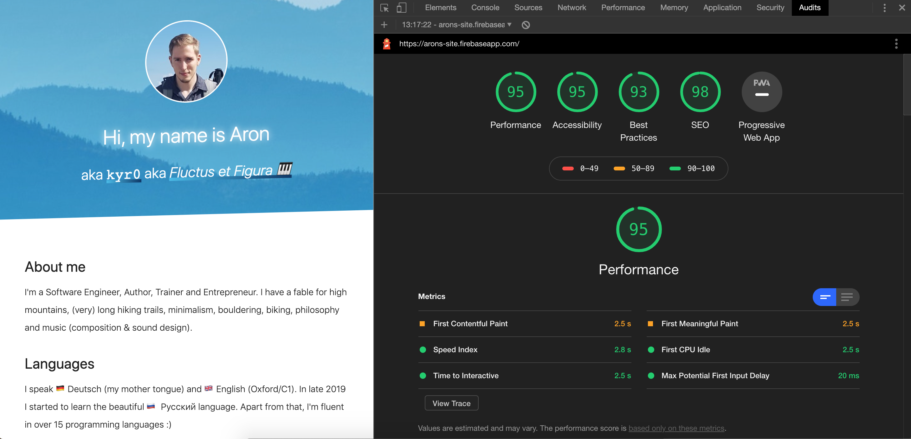

# arons.site / aron-homberg.de

This is a simple, responsible homepage implementation using SpringType.org and Materializecss.com.

It integrates with Firebase Hosting, Firebase Database and Firebase Functions to be simply deployed
in the cloud as well as store and forward emails to my email account.

The purpose of this being open source is to demonstate how easy it is to implement such projects
with the SpringType web framework.



## Setup

To install:

```
yarn
yarn add global firebase-tools
```

To integrate with your firebase project:

```
firebase login
```

## Local development

Just run `yarn start` and open a browser pointing to `http://localhost:4444`.

## Local production build

Just run `yarn start:prod` and take a look at the `dist` folder.

## Deploy to Google Firebase

Copy your firebase credentials and store them in `src/config/firebase.ts`.

Just run `yarn deploy` to deploy the website and cloud function.

## Contact form / email forwarding

To customize the Firebase Cloud Function (contact form forwarding) to your needs, simple register a
new gmail account, activate "untrusted apps", and run:

```
firebase functions:config:set gmail.login=YOUR_GMAIL_ADDRESS gmail.pass=YOUR_GMAIL_PASSWORD
```

